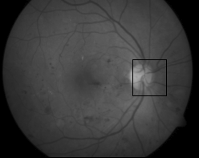
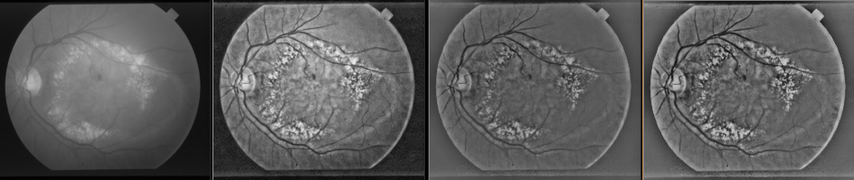
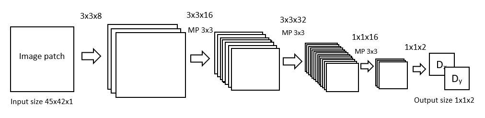

# Optic disc detection in a retina image

2016/2017

Author: Tomáš Sýkora

# detector

A convolutional neural network to detect an optic disc in a retina image. It' accompilshed by predicting distance of a single image patch to the optic disc (x,y position - ground truth) and moving in this direction closer to the optic disc (until close to zero).    

Example output:

# preprocess and train

To train the model, images from the STARE database were used. Preprocessing steps to obtain better visibility of the optic disc and the vein network:

_0) Input image, 1) adaptive histogram equalization, 2) illumination correction, 3) adaptive histogram equalization_

The images divided into patches (45x42) are sent to the CNN. The network consists of fully convolutional layers, output is distance of the patch to the optic disc (x, y directions):

 

# usage

- _detector.py --train_    &nbsp;&nbsp;&nbsp;&nbsp;&nbsp;&nbsp;&nbsp;-trains the neural network
- _detector.py --detect_    &nbsp;&nbsp;&nbsp;&nbsp;-detects the optic disc on one image
- _detector.py --finetune_  &nbsp;-another training to make the network better converge to zero
- _detector.py --eval_      &nbsp;&nbsp;&nbsp;&nbsp;&nbsp;&nbsp;&nbsp;&nbsp;-evaluate the network on a test dataset
